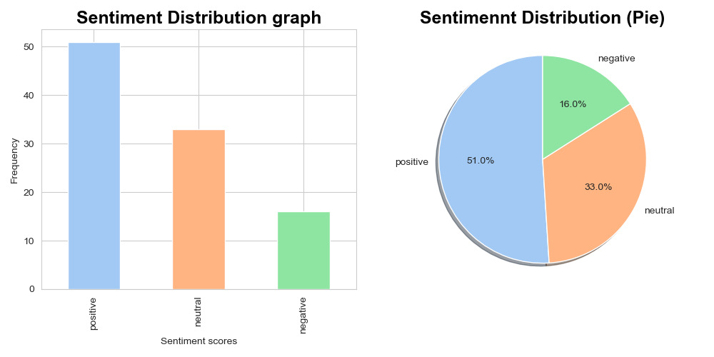

# Sentiment Analysis Pipeline



This repository contains a modular Python pipeline to simulate real-time sentiment analysis of customer feedback for a latest product launch. The solution focuses on a production-ready set of scripts that can be run end‑to‑end from the command line or a notebook.

## Example results

After running the full pipeline on the sample data, each feedback message is assigned VADER sentiment scores and a final label. Below is a sample of the output from `output/sentiment_results.csv`:

| comment_snippet                                  | neg   | neu   | pos   | compound | sentiment_label |
|--------------------------------------------------|-------|-------|-------|----------|-----------------|
| "Love the new features, super easy to use."     | 0.00  | 0.34  | 0.66  | 0.85     | positive        |
| "It's okay, does the job but nothing special."  | 0.00  | 0.72  | 0.28  | 0.19     | neutral         |
| "Really disappointed, keeps crashing on start." | 0.41  | 0.59  | 0.00  | -0.60    | negative        |

These rows illustrate how the pipeline translates raw text into interpretable sentiment scores and labels.

## Features

- Simulates real-time ingestion of customer feedback.  
- Cleans and preprocesses text data.  
- Assigns sentiment scores to each message using VADER.  
- Outputs summarised and visualised results as CSV files and plots.  

## Folder structure

- `scripts/`  
  - `main.py`  
  - `ingest.py`  
  - `preprocess.py`  
  - `analyse.py`  
  - `visualise.py`  

- `output/`  
  - `Sentiment_Distribution_Graph.png`  
  - `sentiment_results.csv`  

- `sample_stream_large.jsonl`  

- `pipeline.log`  

- `requirements.txt`  

- `README.md`  

## Dependencies and setup

Required packages to run the pipeline:

### Core libraries

- argparse  
- pandas  
- time  
- pathlib (`from pathlib import Path`)  
- logging  

Note: `time`, `pathlib`, and `logging` are part of Python’s standard library and do not need to be installed separately.

### NLP tools

Uses NLTK and VADER, with additional downloads required:

- `nltk`  
  - `punkt`  
  - `vader_lexicon`  
  - `stopwords`  
  - `nltk.sentiment.vader`  
  - `nltk.corpus`  

### Visualisation

- matplotlib (including `matplotlib.pyplot`)  
- seaborn  
- plotly (including `plotly.express`)  

## Installation

1. Clone or download this repository.  
2. Ensure Python 3.8+ is installed.  
3. Install the required packages:

   ```bash
   pip install -r requirements.txt
   ```

4. (If needed) Download NLTK resources in a Python shell or notebook:

   ```python
   import nltk
   nltk.download("punkt")
   nltk.download("vader_lexicon")
   nltk.download("stopwords")
   ```

## How to run

You can run the full pipeline either from a notebook or from the command line.

### From a notebook

```bash
%run scripts/main.py --input_file <path_to_jsonl> --output_file <path_to_output_csv> --plot_path <path_to_output_plot_png>
```

Example:

```bash
%run scripts/main.py \
  --input_file "data/sample_stream_large.jsonl" \
  --output_file "output/sentiment_results.csv" \
  --plot_path "output/plots/Sentiment_Distribution_Graph.png"
```

### From the terminal

```bash
python scripts/main.py \
  --input_file data/sample_stream_large.jsonl \
  --output_file output/sentiment_results.csv \
  --plot_path output/plots/Sentiment_Distribution_Graph.png
```

## Pipeline stages

Each script is modular and can be imported or reused in other projects.

1. Ingest (`ingest.py`): Reads data in simulated time chunks from the JSONL stream.  
2. Preprocess (`preprocess.py`): Cleans and tokenizes text; applies custom stopword handling.  
3. Analyse (`analyse.py`): Applies VADER sentiment scoring to each message.  
4. Visualise (`visualise.py`): Generates sentiment distribution and trend plots.  
5. Main (`main.py`): Orchestrates the full pipeline using command-line arguments.  

## Independent design decisions

- Custom chunking logic to simulate real-time ingestion.  
- Additional text preprocessing steps beyond basic requirements.  
- `get_revised_stopwords()` removes sentiment-shifting words (e.g., negations like “not”, “don’t”; intensifiers like “very”; quantifiers like “all”, “none”) from the default NLTK stopwords.  
- Graphs use seaborn’s pastel palette and `whitegrid` style for a clean, accessible look.  
- CLI configuration for flexible, user-driven runs.  
- Code is fully commented, with functions and modules documented for reuse.  
- Uses Python’s built-in `logging` module to track pipeline progress, warnings, and errors; logs are written to `logs/pipeline.log` on each run.  

## Output

- CSV: `output/sentiment_results.csv` with VADER scores (positive, negative, neutral) and compound sentiment per comment.  
- Visualisations: PNG plots saved under `output/plots/`.  

## Troubleshooting

If you run into issues:

- Check you are using Python 3.8 or above.  
- Ensure Jupyter Notebook is installed if you want to run the notebook-based workflow.  
- Verify that all packages from `requirements.txt` are installed.  
- Inspect `pipeline.log` for detailed error messages.  

## Lessons learned

- Improved skills in real-time sentiment analysis, data visualisation, and modular Python programming.  
- Observed how custom preprocessing and flexible design affect model accuracy and usability.  
- Gained experience in clear documentation and ethical use of AI tools.  

## Acknowledgements

- Thanks to the course teaching team for guidance and feedback.  
- README structure inspired by [readme.so](https://readme.so/editor).  
- Visual styling for bar charts was enhanced using seaborn’s official tutorials on aesthetics and color palettes.  
- Additional concepts and techniques were learned from course resources.  
